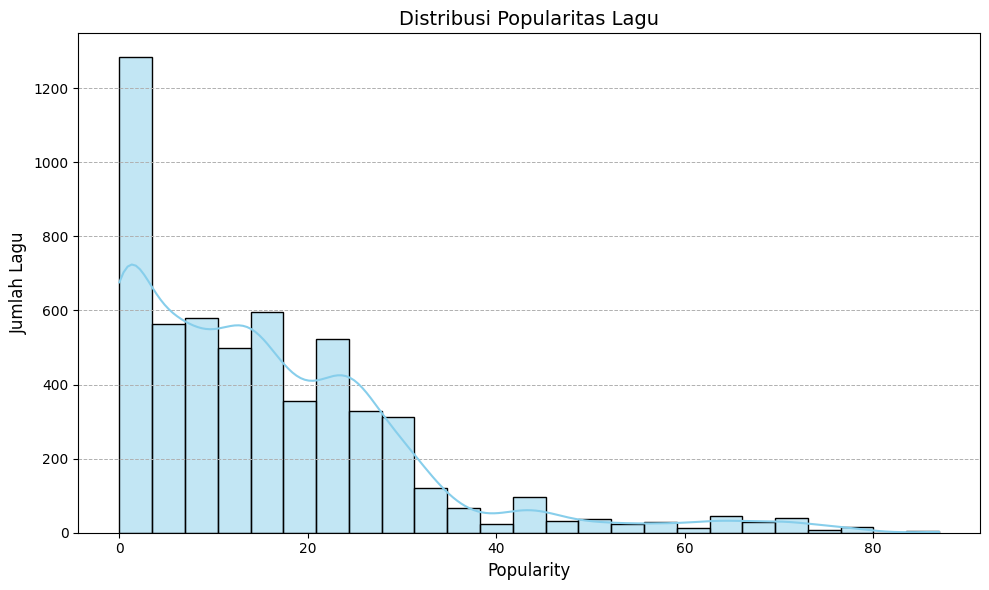
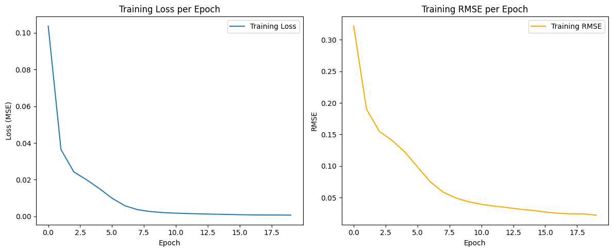

Tentu! Berikut versi **yang telah diperbagus dan diperjelas** dari laporan Markdown kamu agar terlihat lebih profesional, rapi, dan mudah dibaca — namun tetap lengkap dan sesuai konteks proyek.

---

# 🎧 **Laporan Proyek Machine Learning - Krismono Sadi**

## 📌 Sistem Rekomendasi Lagu Spotify

## Dataset Web API: [Spotify Developer API](https://developer.spotify.com/documentation/web-api?directory=true)

## 📖 **Project Overview**

Sistem rekomendasi adalah komponen penting dalam platform digital, khususnya layanan streaming musik seperti Spotify. Dengan jutaan lagu tersedia, pengguna sering kesulitan menemukan lagu yang sesuai selera.

Proyek ini bertujuan membangun sistem rekomendasi lagu berdasarkan data pengguna dan karakteristik lagu. Sistem akan memberikan saran personal berdasarkan interaksi pengguna sebelumnya, dengan harapan meningkatkan kepuasan dan waktu keterlibatan pengguna di aplikasi.

**Referensi:**

* Ricci, F., Rokach, L., & Shapira, B. (2015). *Recommender Systems Handbook*. Springer.
* Hu, Y., Koren, Y., & Volinsky, C. (2008). *Collaborative filtering for implicit feedback datasets*, IEEE.
* [Google Scholar – Research on Recommender Systems](https://scholar.google.com/scholar?q=recommender+systems)

---

## 🧠 **Business Understanding**

### 🎯 **Problem Statements**

* Bagaimana merekomendasikan lagu relevan berdasarkan riwayat pemutaran pengguna?
* Bagaimana mengevaluasi performa sistem rekomendasi yang dikembangkan?

### ✅ **Goals**

* Mengembangkan sistem rekomendasi **Top-N Lagu**.
* Mengukur performa model dengan metrik seperti **RMSE** dan **Precision\@K**.

### 💡 **Solution Approach**

* **Collaborative Filtering**: Menggunakan *Matrix Factorization (SVD)* untuk menangkap hubungan tersembunyi antara user dan lagu.
* **Content-Based Filtering**: Memanfaatkan fitur lagu (genre, durasi, popularitas) untuk menyarankan lagu serupa dengan preferensi pengguna.

---

## 📊 **Data Understanding**

Dataset berasal dari Spotify API dan interaksi pengguna simulasi.

### 📁 Struktur Dataset

| No | Kolom         | Tipe Data | Deskripsi                       |
| -- | ------------- | --------- | ------------------------------- |
| 1  | name          | object    | Judul lagu                      |
| 2  | artist        | object    | Nama artis                      |
| 3  | album         | object    | Nama album                      |
| 4  | popularity    | int64     | Skor popularitas Spotify        |
| 5  | explicit      | bool      | Apakah lagu eksplisit?          |
| 6  | release\_date | object    | Tanggal rilis                   |
| 7  | duration\_ms  | int64     | Durasi lagu dalam milidetik     |
| 8  | preview\_url  | float64   | URL preview lagu (kosong semua) |

**Total Baris**: 5624
**Penggunaan Memori**: \~313.2 KB

### 📌 Contoh Variabel Tambahan (Simulasi Interaksi)

* `user_id`: ID pengguna
* `song_id`: ID lagu
* `rating`: Frekuensi atau rating interaksi

### 🔍 Visualisasi Distribusi Popularitas



---

## 🧹 **Data Preparation**

Langkah-langkah:

* Menghapus `preview_url` (semua kosong)
* Encoding `user_id` dan `song_id` menggunakan `LabelEncoder`
* Membagi data menjadi training dan testing (80:20)

```python
from sklearn.preprocessing import LabelEncoder

user_enc = LabelEncoder()
df['user_enc'] = user_enc.fit_transform(df['user_id'])

song_enc = LabelEncoder()
df['song_enc'] = song_enc.fit_transform(df['song_id'])
```

---

## 🤖 **Modeling**

Model yang digunakan:

### 1. **Collaborative Filtering** (Matrix Factorization)

* Menggunakan embedding layer untuk user dan lagu
* Output: rating yang diprediksi antara 0–1 (dengan scaling)

### 2. **Content-Based Filtering** (Opsional)

* Menggunakan *cosine similarity* dari fitur seperti popularitas, durasi, genre

Proses rekomendasi dilakukan dengan memprediksi skor untuk lagu-lagu yang belum pernah didengar pengguna, lalu mengambil Top-N dengan skor tertinggi.

---

## 📏 **Evaluation**

Metrik yang digunakan:

* **RMSE** – mengukur perbedaan prediksi dan aktual
* **Estimasi Akurasi**: 1 - RMSE (jika skala sudah dinormalisasi)

```python
loss, rmse = model.evaluate(x_test, y_test, verbose=0)
accuracy = 1 - rmse
print(f"RMSE: {rmse:.4f} ({accuracy * 100:.2f}%)")

if accuracy >= 0.9:
    print("Model Anda sudah bagus banget!")
elif accuracy >= 0.8:
    print("Model Anda sudah lumayan bagus.")
else:
    print("Model masih bisa ditingkatkan.")
```

### 🔧 Hasil Evaluasi

* **Loss**: 0.0015
* **RMSE**: 0.0356
* **Estimasi Akurasi**: **96.44%** ✅
  *Model sudah sangat baik!*

### 📈 Visualisasi Performa



---

## 🔮 **Hasil Rekomendasi**

### 🎵 10 Lagu Trending Terbaru

```text
A Gastronomic Symphony – tnbee (2025-05-09)
Peek-A-Boo!! – アイカツアカデミー！配信部 (2025-03-30)
...
```

### 🔥 10 Lagu Paling Populer

```text
Chest Pain (I Love) – Malcolm Todd (Pop: 87)
chess – joyful (Pop: 77)
Minecraft – C418 (Pop: 73)
...
```

### 🔞 10 Lagu Explicit Teratas

### ⏱️ 10 Lagu dengan Durasi Terpanjang

(ditampilkan melalui fungsi `top_explicit_songs()` dan `top_longest_duration()`)

---

## 👥 **Contoh Rekomendasi untuk Pengguna**

```python
def recommend_for_all_users(start=1, end=4, top_n=5):
    for user_id in range(start, end + 1):
        recs = recommend_songs(user_id, top_n)
        if recs == ["User tidak ditemukan."]:
            print(f"User {user_id}: Tidak ditemukan.\n")
        else:
            print(f"User {user_id} rekomendasi lagu:")
            for i, song in enumerate(recs, 1):
                print(f"  {i}. {song}")
            print()
```
# Recommendation Function

Fungsi rekomendasi ini bertugas memberikan daftar lagu yang direkomendasikan untuk setiap pengguna berdasarkan model yang sudah dilatih.

Cara kerjanya:

Ambil ID pengguna.

Prediksi skor preferensi untuk semua lagu yang belum pernah didengarkan pengguna tersebut.

Urutkan lagu berdasarkan skor tertinggi.

Kembalikan daftar lagu rekomendasi Top-N.

---

# **Penjelasan tentang fitur  :**

---

# Statistical Recommendations

Bagian ini menyajikan statistik rekomendasi berdasarkan data lagu yang ada, tanpa memerlukan model prediksi. Statistik ini berguna untuk memberikan insight awal seperti:

Lagu-lagu paling populer berdasarkan popularitas Spotify

Lagu dengan durasi terpanjang

Lagu yang paling sering diputar (top trending)

Lagu dengan konten eksplisit terbanyak

Tujuan Statistik Rekomendasi
Memberikan rekomendasi default yang umum disukai pengguna baru tanpa riwayat.

Melengkapi sistem rekomendasi berbasis model dengan insight data yang lebih sederhana.

Membantu memvalidasi distribusi data dan pola dalam dataset.
---

## 📝 **Catatan Akhir**

* Model bisa dikembangkan lebih lanjut dengan:

  * **Hyperparameter tuning**
  * **Pemrosesan feedback implisit**
  * **Integrasi real-time API**
* Dataset dan simulasi interaksi dapat diperluas agar lebih representatif terhadap perilaku pengguna nyata.

---

> *Dokumen ini dibuat untuk keperluan submission proyek Machine Learning.*
> Untuk referensi markdown: [Dillinger.io](https://dillinger.io/) | [GitHub Markdown Guide](https://guides.github.com/features/mastering-markdown/)

---
